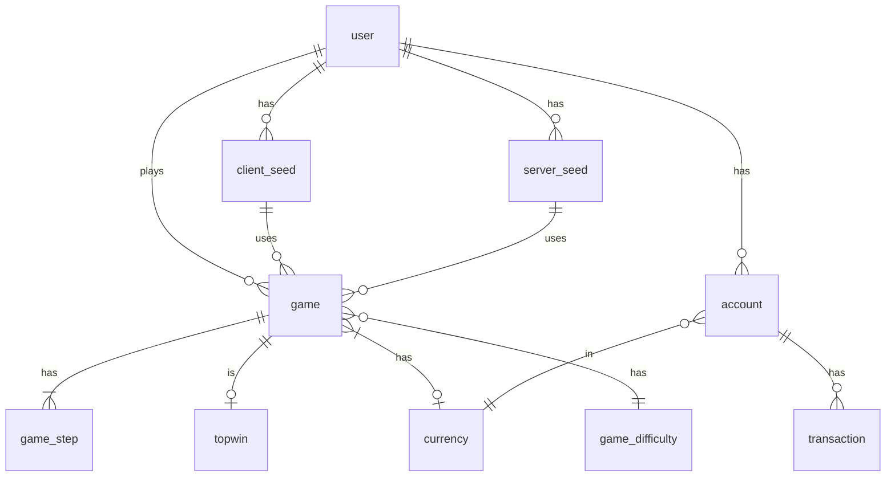
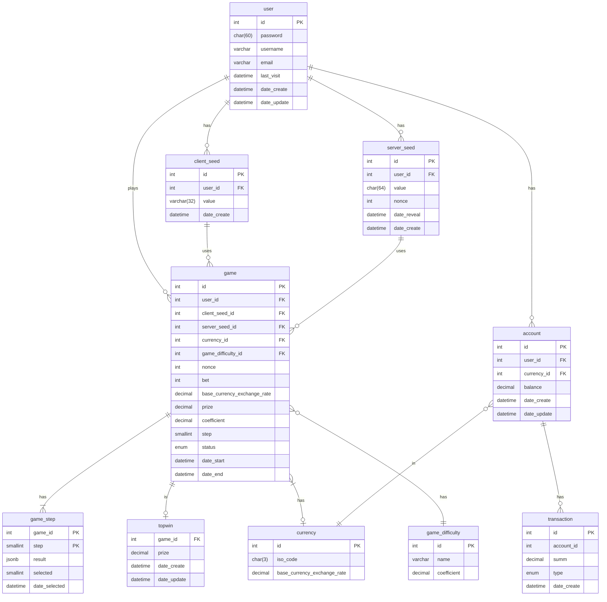

# Introduction

## Clone BitKong Game Service

Welcome to the Clone BitKong Game Service API documentation. This service allows you to play a thrilling game where you can bet and win based on your luck and strategic choices.
Our game consists of a 10-level playing field with each level having one empty cell and three cells with prizes. Choose wisely, and you could multiply your stake with each correct pick!

## Features

- Play a fun and addictive game with multiple levels.
- Try your luck to multiply your initial bet with level coefficients.
- Access your personal betting history.
- View statistics of big wins from other users.
- Secure betting with client and server seeds for fair play.

Let's get started on how to set up and use the Clone BitKong Game Service API.
 

## Prerequisites

Before you begin, make sure you have the following:

- An account on bitkong.com.
- Basic understanding of RESTful APIs and HTTP methods.
- A tool to make HTTP requests (e.g., `curl`, Postman, or any HTTP client library for your programming language of choice).

Ensure you are also familiar with the entity relationship diagram provided to understand the data model of our service.

### [Conceptual Diagram](#conceptual)


### [Logical Diagram](#logical)

 
## Authentication

To access the Clone BitKong Game Service API, you'll need to authenticate using your user credentials. Follow these steps to authenticate:

1. Obtain an API key by registering on our website or through our customer support.
2. Use the API key in the `Authorization` header of your HTTP requests.

Example of including an API key in a request header:

```http
GET /api/games HTTP/1\.1
Host: api\.bitkong\.com
Authorization: Bearer YOUR\_API\_KEY\_HERE
 ```
## Making a Bet

To place a bet, follow these steps:

1. Choose the amount you want to bet.
2. Select a currency.
3. Pick a difficulty level for the game.
4. Generate and submit client and server seeds for the bet.

Here is an example request to place a bet:

```http
POST /api/bet HTTP/1\.1
Host: api\.bitkong\.com
Content-Type: application/json
Authorization: Bearer YOUR_API_KEY_HERE

{
  "betAmount": 10,
  "currency": "BTC",
  "difficulty": "EASY",
  "clientSeed": "YOUR_CLIENT_SEED",
  "serverSeed": "YOUR_SERVER_SEED"
}
```
 
## Playing the Game

Once your bet is placed, you can start playing by choosing cells at each level. If you select a cell with a prize, you proceed to the next level; otherwise, the game ends.

To make a move:

```http
POST /api/game/play HTTP/1\.1
Host: api\.bitkong\.com
Content-Type: application/json
Authorization: Bearer YOUR_API_KEY_HERE

{
  "gameId": "YOUR_GAME_ID",
  "level": 1,
  "cell": 2
}
```
 
Replace `YOUR_GAME_ID` with the ID of the game you're playing, `level` with the current level number, and `cell` with the cell number you're choosing (1-4).
 
## Checking Game History

You can check your betting history to review your past games and outcomes.

To retrieve your betting history:

```http
GET /api/user/history HTTP/1\.1
Host: api\.bitkong\.com
Authorization: Bearer YOUR\_API\_KEY\_HERE
```
 
## Viewing Top Wins

Stay updated with the biggest wins on our platform by checking the top wins leaderboard.

To view top wins:

```http
GET /api/topwins HTTP/1\.1
Host: api\.bitkong\.com
Authorization: Bearer YOUR\_API\_KEY\_HERE
```

## Handling Errors & Support

Thank you for using Clone BitKong Game Service!
Make sure to replace placeholders like `YOUR_API_KEY_HERE`, `YOUR_CLIENT_SEED`, `YOUR_SERVER_SEED`, and `YOUR_GAME_ID` with actual values when making requests\.
This is a basic structure for your GitHub documentation\. You may want to add more details or sections depending on the complexity of your API and the needs of your users\. 
